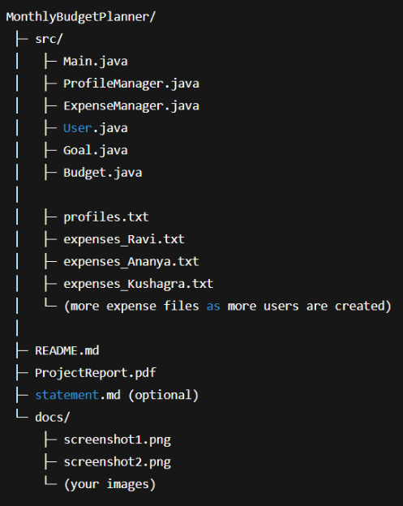
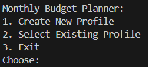
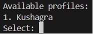
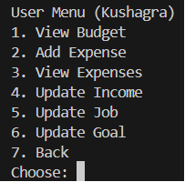
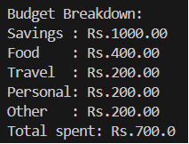

**Monthly Budget Planner:**

This project is a simple console based budget management system written in Java. It allows users to create offline local profiles, add expenses, update their income and goals, and view their monthly recommended budget.

This entire project works offline, stores data using text files.

**Features:**

**1. Local Profiles(Offline Storage):**

   Each user can create a plan with:

- Name
- Profession
- Monthly Income
- Optional Savings Goal

  Profiles are stored in a single file: 

  *Profiles.txt*

**2. Selecting Existing Profiles**

   Users can choose from previously created profiles when running the program again.

**3. View Monthly Budget:**

   Recommended monthly savings are calculated based on:

   10% of income

   OR

   Amount needed to reach their goal

**4. Add Expenses**

   Users can add expenses with:

- Amount
- Short Note(like food, travel, books etc.)

Expenses are stored per user in a file like:\
expenses\_Ravi.txt

**5. View All Expenses**

   Displays all recorded expenses for the selected user.

**6. Update Profile Information**

   Users can update:

- Monthly income
- Profession
- Savings Goal

All changes are saved permanently

**Project Structure:**

**How to run Project?**

**Step 1: Open terminal in src folder**

Navigate to the folder containing all .java files

**Step 2: Compile all files using:**\
javac \*.java

**Step 3: Run the program using:**\
java Main

**How Data is Stored?**

**Profiles file(profiles.txt):**

Name|Job|Income|GoalAmount|GoalMonths

**Expenses file:**

120 Food

60 Travel

30 Books

**Sample Output:**

\

**Technologies and concepts used:**

- Java classes and objects
- Constructors
- Methods
- File Handling(Buffered Reader/Buffered Writer)
- Loops(for, while)
- Conditional Statements(if-else, switch)
- Exception Handling
- Lists
- Modular Program Structure

**Author:**

**Aditya Patel(24BAI10676)**

